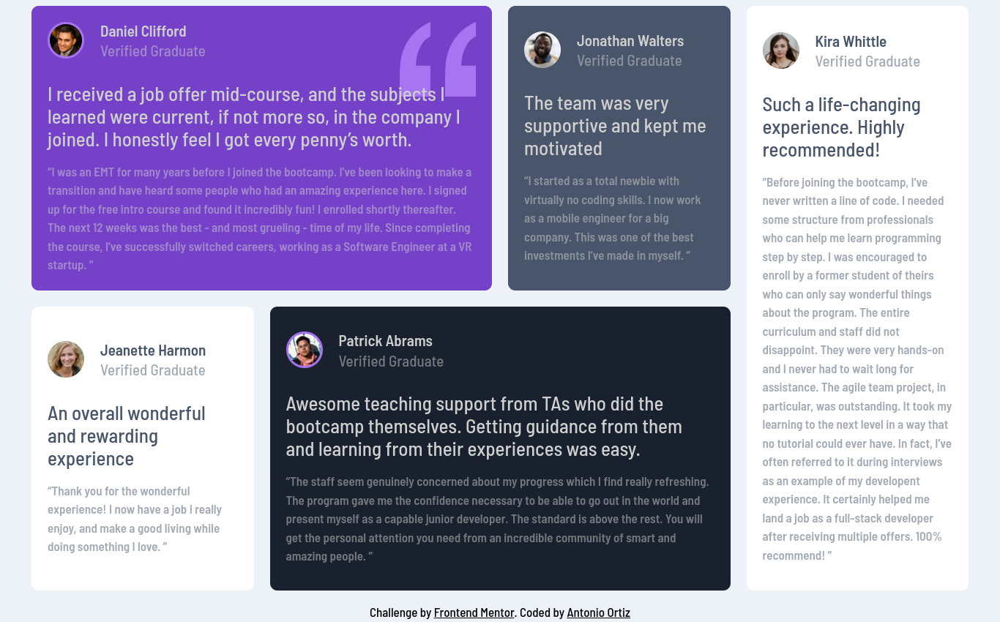

# Frontend Mentor - Testimonials grid section solution

This is a solution to the [Testimonials grid section challenge on Frontend Mentor](https://www.frontendmentor.io/challenges/testimonials-grid-section-Nnw6J7Un7). Frontend Mentor challenges help you improve your coding skills by building realistic projects.

## Table of contents

- [Overview](#overview)
  - [The challenge](#the-challenge)
  - [Screenshot](#screenshot)
  - [Links](#links)
- [My process](#my-process)
  - [Built with](#built-with)
  - [What I learned](#what-i-learned)
  - [Continued development](#continued-development)
  - [Useful resources](#useful-resources)
- [Author](#author)

## Overview

### The challenge

Users should be able to:

- View the optimal layout for the site depending on their device's screen size

### Screenshot

### Links

- Solution URL: [Frontend Mentor](https://www.frontendmentor.io/profile/ortiz-antonio)
- Live Site URL: [GH Pages](https://ortiz-antonio.github.io/testimonials-grid-section)

## My process

### Built with

- Semantic HTML5 markup
- CSS custom properties
- Flexbox
- CSS Grid
- Mobile-first workflow
- Cube CSS
- Eleventy

### What I learned

I learned about css grids and different methods on placement

### Continued development

I will continue explore grids and differents ways to use it.

### Useful resources

- [An interactive guida to css Grid](https://www.joshwcomeau.com/css/interactive-guide-to-grid/) - Help me understand grids and his properties

## Author

- Website - [Antonio Ortiz](https://ortiz.studio)
- Frontend Mentor - [Antonio Ortiz](https://www.frontendmentor.io/profile/ortiz-antonio)
